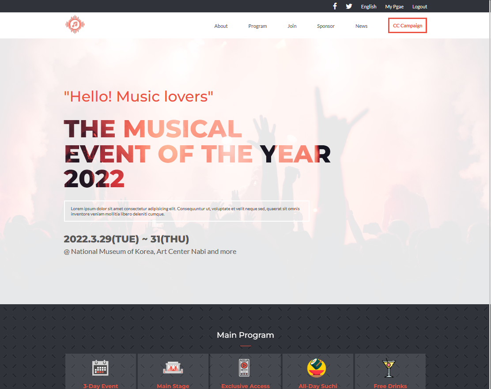
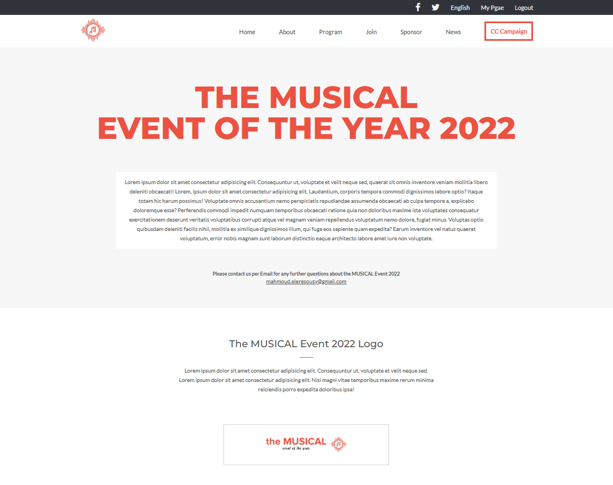
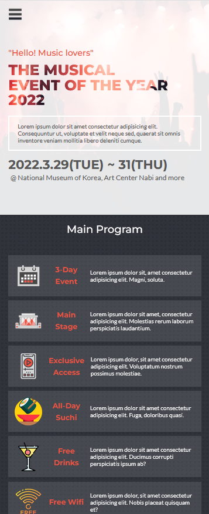
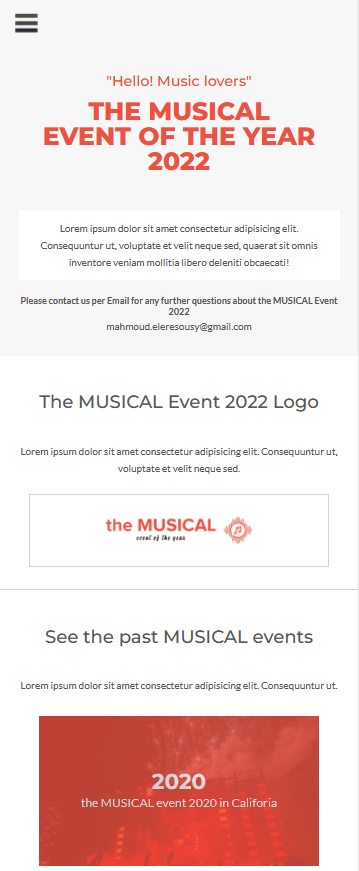

# the MUSICAL

> Sample Design of Imaginaty the MUSICAL Event 2022 

 
 

Additional description about the project and its features.

## Built With

- HTML
- CSS
- JS

## Live Demo

[Live Demo Link](https://elerqsousy.github.io/musical-concert-page/)

## Authors

👤 **Mahmoud Rizk**

- GitHub: [@Elerqsousy](https://github.com/Elerqsousy)
- LinkedIn: [Mahmoud El Erqsousy](https://www.linkedin.com/in/mahmoud-rizk/)

## 🤝 Contributing

Contributions, issues, and feature requests are welcome!

Feel free to check the [issues page](../../issues/).

## Show your support

Give a ⭐️ if you like this project!

## Acknowledgments

- The [design](https://www.behance.net/gallery/29845175/CC-Global-Summit-2015) is originally created by [@Cindy Shin](https://www.behance.net/adagio07) with an open [license](https://creativecommons.org/licenses/by-nc/4.0/) of NonCommercial use. Some modifications has been made to fit the needed requirment of the project. This project is designed as an assignment for my school and not for commercial use. 

## 📝 License

This project is [MIT](./LICENSE) licensed.
